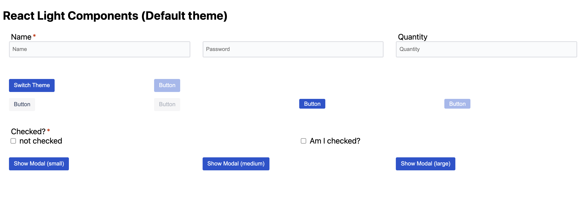

# React Light 💡 Components (BETA)


A lightweight React Web Components Library *(BETA)* with the following design:

+ Typescript based
+ Accessibility First
+ Access to most of all HTML attributes
+ Simple and Standardized API
+ UI/UX driven for easy custom theming and sizing thru CSS
+ No inline styles and JS-styles support (see above)
+ Simplified Components looking for modern Browser's natives implementations
+ No third-party dependencies

*ATTENTION:* This project is currently on development (BETA) and it's not ready for production yet as API may change due to improvements on next releases. We highly recommend to test this in POCs, prototypes and small projects that might not be used in production in a short term. We are working hard to make it ready for production soon. Feedbacks are really welcome! :)

# Screenshots




# Getting Started *(BETA)*

## Option #1: [npm](https://www.npmjs.com/package/react-light-components)

### 🚀 Installation

  + `npm install react-light-components`

### 🖌️ Example with Default theme

```tsx
import React from 'react';
import { Button } from 'react-light-components';

import './node_modules/react-light-components/dist/bundle/react-light-components.min.css';

export default class App extends React.Component {
  public render() {
    return (
      <div>
        <Button onClick={() => console.log('clicked')}/>
      </div>
    );
  }
}
```
`index.tsx`

## Option #2: [use from CDN](https://cdn.jsdelivr.net)

### 🚀 CDN URLs
  + JS: `https://cdn.jsdelivr.net/npm/react-light-components@0.0.2/dist/bundle/react-light-components.min.js`
  + CSS: `https://cdn.jsdelivr.net/npm/react-light-components@0.0.2/dist/bundle/react-light-components.min.css`

## Option #3: [Download](https://www.npmjs.com/package/react-light-components)

### 🚀 Download bundle

+ Download as a manual dependency:
  + [Download](https://github.com/bidicode/react-light-components/releases/download/v0.0.2/dist.zip)
  + Unzip dist.zip into your JS and styles 

# APIs and customisations

The documentation regarding APIs and customisations is currently in progress, in other hand the `examples` directory contains some usage samples about the features implemented and it's helpful to understand in details how to use it.

# Contributors: Getting Started

+ `nvm install v14.15.0` then `nvm use v14.15.0`
+ `npm install`
+ `npm run examples` to visualize all components and examples
+ `npm run test` to test changes

